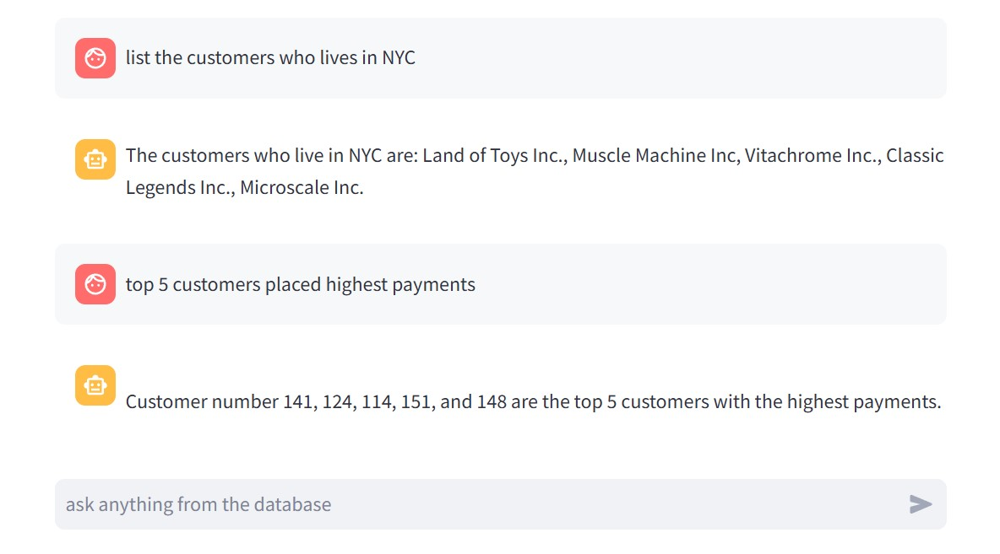

# GenAI_DB
Build a Gen AI application to answer the customer queries by fetching data from database

- [Project Overview](#project-overview)
- [Data Sources](#data-sources)
- [Application-ui](#application-ui)

  ## Project Overview
  Connect a local MySQL database using LangChain and build a sample Generative AI application that answers user queries about customer orders, leveraging natural language processing to interact with structured data seamlessly.
  
  ## Data Sources
  

  ## Application UI
  
  

